# Procesverslag
Markdown is een simpele manier om HTML te schrijven.  
Markdown cheat cheet: [Hulp bij het schrijven van Markdown](https://github.com/adam-p/markdown-here/wiki/Markdown-Cheatsheet).

Nb. De standaardstructuur en de spartaanse opmaak van de README.md zijn helemaal prima. Het gaat om de inhoud van je procesverslag. Besteedt de tijd voor pracht en praal aan je website.

Nb. Door *open* toe te voegen aan een *details* element kun je deze standaard open zetten. Fijn om dat steeds voor de relevante stuk(ken) te doen.

https://alanaeastman.github.io/blokWeb/

## Jij

uitwerken voor kick-off werkgroep

### Auteur:
Alana Eastman

#### Je startniveau:
blauwe piste

#### Je focus:
surface 
 

## Je website

uitwerken voor kick-off werkgroep

### Je opdracht:
https://devierbroers.nl/

#### Screenshot(s) van de eerste pagina (small screen): 
de vier broers (restaurant) homepagina
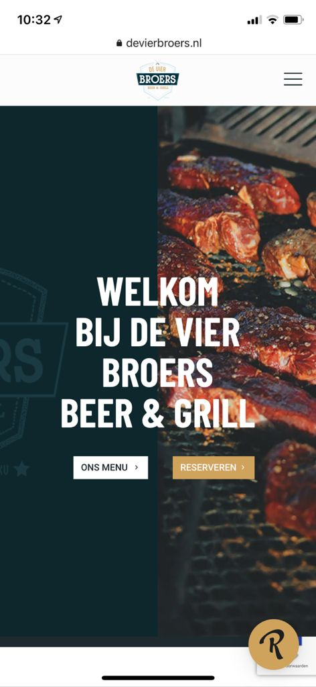

#### Screenshot(s) van de tweede pagina (small screen):
de vier broers menukaart
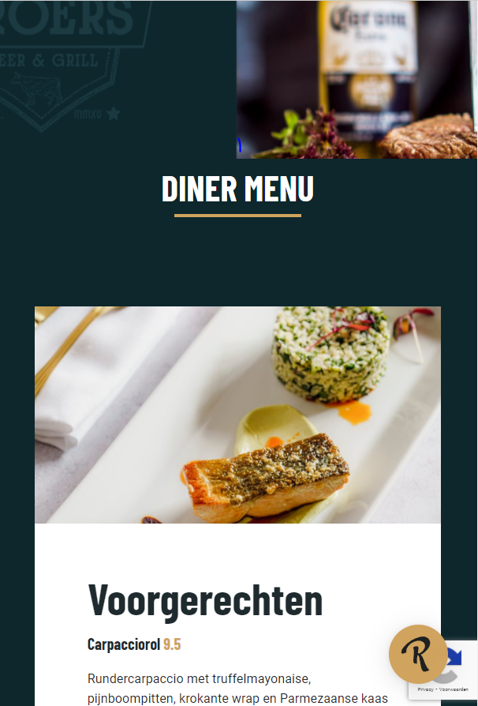
 

## Breakdownschets (week 1)

uitwerken na afloop 2e werkgroep

### de hele pagina: 
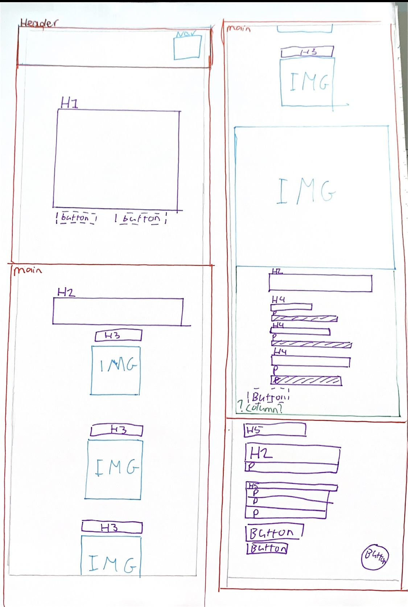

### dynamisch deel (menu): 

## Voortgang 1 (week 2)

uitwerken voor 1e voortgang

### Stand van zaken
Code is nooit mijn beste vak geweest dus naar verwachting moet ik hard werken om het bij te houden. Toch lukken de opdrachten over het algemeen wel en ik vind dat ik al een goede basis heb voor mijn eindopdracht. Uiteraard is het nog niet goed genoeg, maar ik merk dat ik al goed op weg ben. De opdrachten van de blauwe piste lukken bijna altijd. Als het niet in een keer lukt vraag ik het in de les aan de docent en dan snap ik het wel. Alhoewel een specifiek ding toepassen in een oefening, zoals positioneren of flexbox, redelijk goed gaat, vind ik het allemaal toepassen op mijn site toch best wel lastig. 0t

### Agenda voor meeting
samen met je groepje opstellen

Vraag 1:   
Hoe krijg ik ons menu en reserveren in het midden?    

vraag 2:
Moet ik al een nav kunnen stylen of krijgen wij daar nog les over? 

### Verslag van meeting
De studentassistenten hebben mij kunnen helpen met mijn vragen en hebben ook nog even mee gekeken naar mijn code. Ze gaven mijn tips 
over hoe ik sommige dingen het beste kon aanpakken. Dat was erg nuttig. Ik heb pas één pagina en ben dus nog niet heel ver, maar ik 
weet nu wel hoe ik verder moet, dus dat is erg fijn. 

hier na afloop snel de uitkomsten van de meeting vastleggen

- Vragen zijn beantwoord
- tips hoe ik verder kan met mijn code zijn gegeven

## Voortgang 2 (week 3)

uitwerken voor 2e voortgang

### Stand van zaken
Deze week hebben we een gesprek met de docent. Ik heb al twee pagina's redelijk gesteld met css maar het is nog niet af. Het lukt mij maar niet om de header main en footer netjes onder elkaar te zetten, dus ik doe iets verkeerd maar ik weet niet wat. Ook staat de h1 op de ene pagina wel in het midden, maar op de andere pagina niet. Dit soort kleine dingen loop ik nu tegen aan, maar mijn website begint al redelijk mooi te worden. 

### Agenda voor meeting
samen met je groepje opstellen

vraag 1:
Hoe krijg ik mijn footer main  

vraag 2:
Eerste afbeelding heeft een padding Hoe krijg ik die het best weg
### Verslag van meeting
hier na afloop snel de uitkomsten van de meeting vastleggen

- De oplossing van mijn eerste vraag was echt heel makkelijk en het is erg dat ik er zelf niet op kwam. Ik had met position gewerkt inplaats van padding en margin. Dat werkt gewoon een heel stuk minder goed. Dat heb ik nu aangepast en nu ziet het er gelijk goed uit.

- Dit probleem was iets minder makkelijk op te lossen. Uiteindelijk heb ik het opgelost door alleen de eerste afbeelding aan te spreken. nu spreek ik hem aan met main div:nth-of-type(1), maar eigenlijk wil ik geen divjes gebruiken dus dit moet ik nog aanpassen. 

## Toegankelijkheidstest (week 4)

uitwerken na test in 8e voortgang

### Bevindingen
- screenreaders zijn erg gebruikonvriendelijk
- Zelfs als je kan zien zijn screenreaders lastig te gebruiken. Als je slecht zient bent is dit vrijwel onmogelijk aan het begin. 
- Er word veel content geskipt door een screenreader. Mijn h's p's en alttekst werd niet voorgelezen. 
- Het schokapparaatje was het vervelendste om mee te testen. 

#### screenreaders zijn erg gebruikonvriendelijk
Screenreaders zijn erg gebruiksonvriendelijk. Je gaat eerst door alle linkjes heen en het duurt eeuwig. als je dan het verkeerde linkje opent moet je weer helemaal terug. Je bent minuten bezig om ergens te komen wat iemand zonder beperking 10 seconden zou duren. 

Een oplossing zou zijn om een versimpelde website te maken speciaal voor mensen die een screenreader gebruiken, met minder content. Alleen de belangrijke dingen staan daar op. 

#### Zelfs als je kan zien zijn screenreaders lastig te gebruiken. Als je slecht zient bent is dit vrijwel onmogelijk aan het begin. 
Toen ik de screanreader aanzetten begreep ik aan het begin echt niet hoe het werkte. Het lukte mij in de eerste instantie niet eens om de screenreader aan te zetten omdat ik hem steeds deativeerde toen ik op akkoord wilde drukken. Toetsen werken heel anders dan ik gewend ben. Wat heel dom is is dat de uitleg van de screenreader er uitgeschreven staat. Ik kan lezen dus ik kan zien hoe het werkt. Als je een screenreader nodig hebt kan je soms niet lezen en betekend dit dat je afhankelijk bent van iemand anders om jouw screenreader aan te zetten en jouw uit te leggen hoe dit moet. 

Als je de screenreader aan zet zouden de toetsen uitgesproken moeten worden. Op je telefoon wordt alles voorgelezen als je door content heen gaat, maar op mijn laptop had ik dat niet. Dat zou wel standaard zo moeten zijn, niet een instelling die je zelf aan en uit kan zetten. 

#### Er word veel content geskipt door een screenreader. Mijn h's p's en alttekst werd niet voorgelezen.  
Toen ik ging testen las de screenreader alleen de links voor. Ik zou zelf niet weten hoe mijn h's en p's voorgelezen zouden moeten worden. Als ik hier meer tijd voor had gehad had ik daar graag nog extra onderzoek naar gedaan, want ik vind het best gek dat screenreaders zo ontoegankelijk zijn. Helaas heb ik voor deze opdracht maar beperkte tijd en ik vind code al lastig zat, dus ik heb er voor gekozen om mij hier niet verder in te verdiepen. 

#### Het schokapparaatje was het vervelendste om mee te testen.
Dit apparaat was niet alleen vervelend omdat het heel naar voelde, maar het beperkt je flink in je gebruik. Ik had geen controle meer over mijn hand en ik deed van alles dat helemaal niet de bedoeling was. 

Ik heb nagedacht over wat hier de beste oplossingen voor zouden kunnen zijn. 

Allereerst, veel grotere knoppen, want in een keer juist klikken als er zo'n "kleine" knop is is gewoon erg lastig. Ik denk niet dat een website standaard grote knoppen moet hebben. Dit zou in veel gevallen nuttige ruimte van de site in nemen. Ik had dit graag nog aangepast in mijn site dat je zelf de knop grootte kon aanpassen, maar ook daar heb ik helaas geen tijd meer voor.

## Voortgang 3 (week 4)

uitwerken voor 3e voortgang

### Stand van zaken
Mijn basiswebsite is zo goed als af, nu worddt het tijd om de surface laag toe te passen. Ik vind dit best wel spannend omdat ik dit nooit echt eerder heb gedaan en code is niet mijn beste vak. Ik hoop dat het allemaal gaat lukken voor het eindgesprek, maar als ik gewoon goed door werk ben ik er van overtuigd dat het moet lukken. Zelf heb ik nu niet zo veel vragen omdat ik nog niet begonnen ben met de surface maar de basiswebsite is zo goed als af dus daar heb ik geen vragen meer over. 

### Agenda voor meeting
samen met je groepje opstellen

vraag 1:
- Zijn de surface lagen die ik van plan ben om te doen goed of is er iets dat jullie af raden

### Verslag van meeting
hier na afloop snel de uitkomsten van de meeting vastleggen

- De studentassistenten hebben gehoord wat mijn plannen waren en vonden dat ik leuke ideeën had. Dat betekend dat het nu tijd is om mij te focussen om de surface laag. 
- De studentassistenten hebben ook even naar mijn code gekeken. Ik kreeg als commentaar dat ik redelijk veel classes had, dus die moest ik uit mijn code gaan halen. 

## Eindgesprek (week 5)

uitwerken voor eindgesprek

### Stand van zaken
Voor dit vak heb ik hard moeten werken. Door mijn geschiedenis met html en css was ik erg bang dat ik moeite zou hebben met dit vak. Helaas bleek dat ook waar te zijn. Ik heb geprobeerd altijd alle opdrachten te maken en mijn huiswerk goed bij te houden, en opzich ging het wel redelijk. Mijn grootste frustratie is als je denkt dat iets moet werken en dan werkt het niet. En wat ik ook probeer het blijft maar niet werken. 

Ik heb mijn best gedaan om wat leuke animaties en extratjes toe te voegen. Vooral in de laatste week heeft dit vak mij redelijk wat stress opgeleverd. Ik vind dat ik mijn best heb gedaan en als ik meer tijd had was het misschien nog wel wat uitgebreider geweest. Soms vond ik het vak erg leuk, maar vaak vond ik het lastig en frustrerend. 

Ik had achter mijn logo een witte achtergrond geplaats die dan net zoals bij het logo position:fixed was zodat je altijd het logo bleef zien. Een uur voor de eind oplevering werkte dat oppeens niet meer en dat soort dingen vind ik dus echt verschrikkelijk aan code. 

Ondanks dat ben ik trots op mijn resultaat. Dit is overduidelijk de mooiste site die ik ooit heb gemaakt met html en css. 

### Screenshot(s)
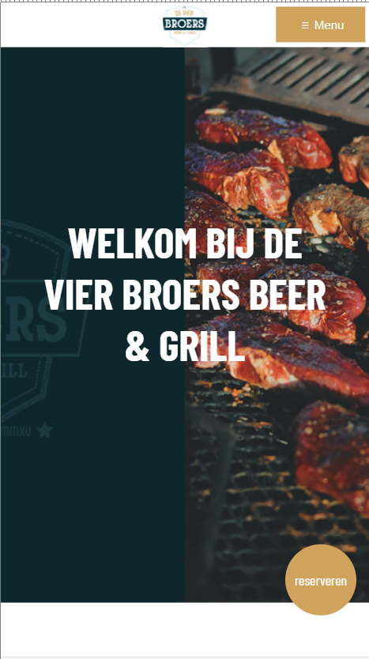
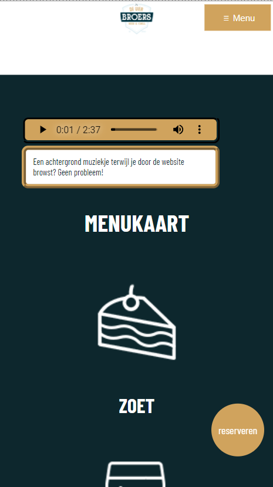
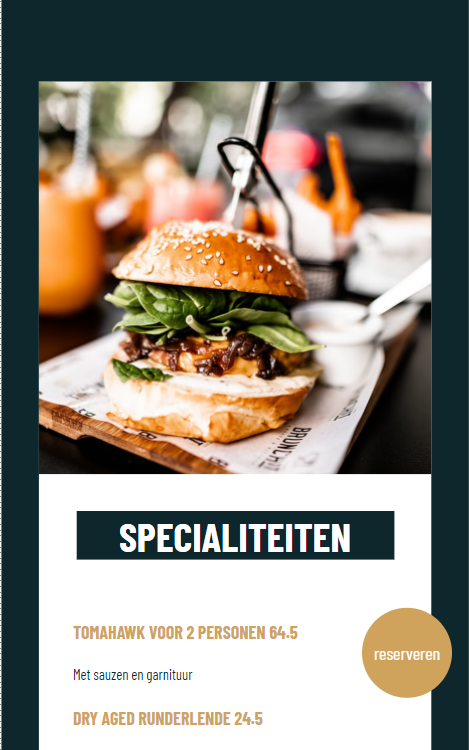
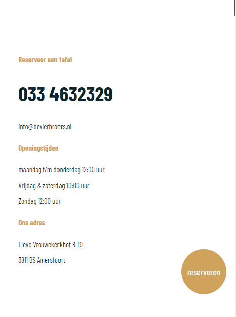

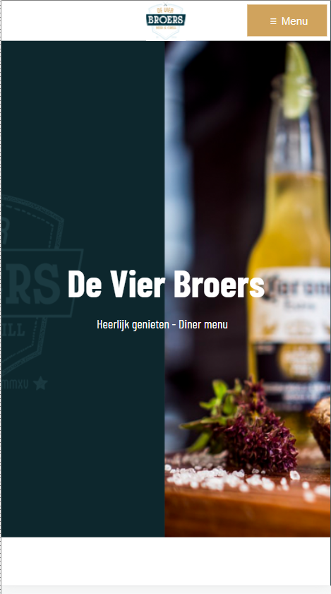
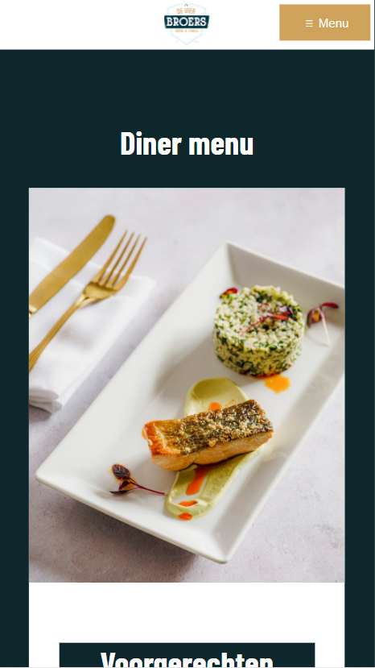
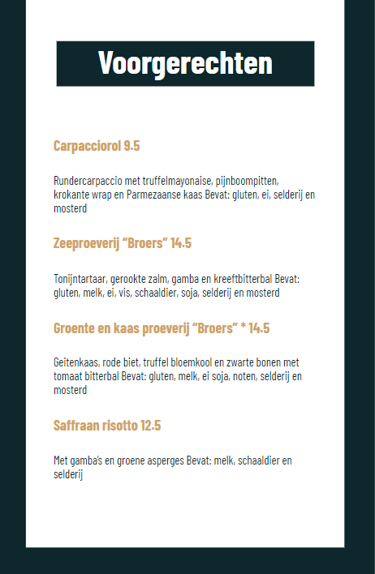
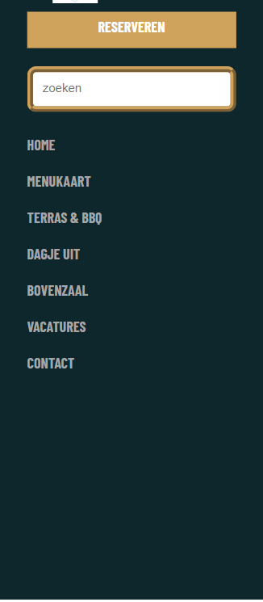

## Bronnenlijst

continu bijhouden terwijl je werkt

Nb. Wees specifiek ('css-tricks' als bron is bijv. niet specifiek genoeg).

1. zoekbalk https://www.w3schools.com/howto/howto_css_searchbar.asp
2. Code van codepen van Sanne ->https://codepen.io/alanaeastman/pen/BaZGxdO?editors=1010
3. Audio van https://www.bensound.com
4. //Code van Sanne uit Codepen voor Javascript ->https://codepen.io/alanaeastman/pen/BaZGxdO?editors=1010 -->
5. https://codepen.io/shooft/pen/ExXvOmx?editors=1100
6. https://codepen.io/shooft/pen/zYzdMwO?editors=1100 
7. object-fit: cover; -> Geholpen door vasilis tijdens de les
8. image in article in section -> Geholpen door broer

