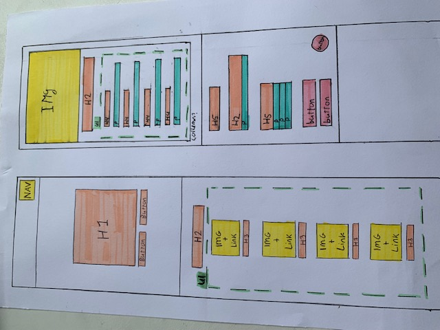
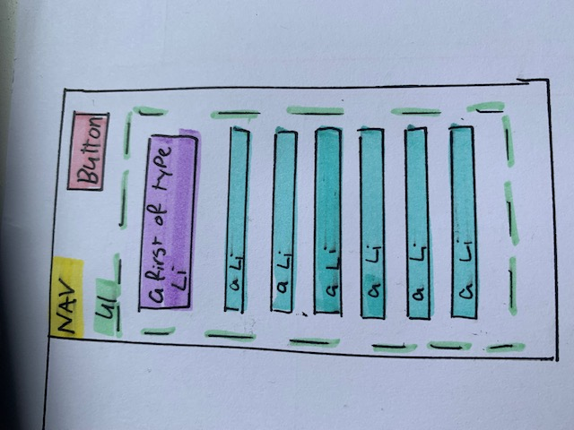

# Procesverslag
Markdown is een simpele manier om HTML te schrijven.  
Markdown cheat cheet: [Hulp bij het schrijven van Markdown](https://github.com/adam-p/markdown-here/wiki/Markdown-Cheatsheet).

Nb. De standaardstructuur en de spartaanse opmaak van de README.md zijn helemaal prima. Het gaat om de inhoud van je procesverslag. Besteedt de tijd voor pracht en praal aan je website.

Nb. Door *open* toe te voegen aan een *details* element kun je deze standaard open zetten. Fijn om dat steeds voor de relevante stuk(ken) te doen.

https://alanaeastman.github.io/blokWeb/

## Jij

uitwerken voor kick-off werkgroep

### Auteur:
Alana Eastman

#### Je startniveau:
blauwe piste

#### Je focus:
surface 
 

## Je website

uitwerken voor kick-off werkgroep

### Je opdracht:
https://devierbroers.nl/

#### Screenshot(s) van de eerste pagina (small screen): 
de vier broers (restaurant) homepagina

#### Screenshot(s) van de tweede pagina (small screen):
de vier broers menukaart

 

## Breakdownschets (week 1)

uitwerken na afloop 2e werkgroep

### de hele pagina: 

### dynamisch deel (menu): 

## Voortgang 1 (week 2)

uitwerken voor 1e voortgang

### Stand van zaken
Code is nooit mijn beste vak geweest dus naar verwachting moet ik hard werken om het bij te houden. Toch lukken de opdrachten over het algemeen wel en ik vind dat ik al een goede basis heb voor mijn eindopdracht. Uiteraard is het nog niet goed genoeg, maar ik merk dat ik al goed op weg ben. De opdrachten van de blauwe piste lukken bijna altijd. Als het niet in een keer lukt vraag ik het in de les aan de docent en dan snap ik het wel. Alhoewel een specifiek ding toepassen in een oefening, zoals positioneren of flexbox, redelijk goed gaat, vind ik het allemaal toepassen op mijn site toch best wel lastig. 0t

### Agenda voor meeting
samen met je groepje opstellen

Vraag 1:   
Hoe krijg ik ons menu en reserveren in het midden?    

vraag 2:
Moet ik al een nav kunnen stylen of krijgen wij daar nog les over? 

### Verslag van meeting
De studentassistenten hebben mij kunnen helpen met mijn vragen en hebben ook nog even mee gekeken naar mijn code. Ze gaven mijn tips 
over hoe ik sommige dingen het beste kon aanpakken. Dat was erg nuttig. Ik heb pas één pagina en ben dus nog niet heel ver, maar ik 
weet nu wel hoe ik verder moet, dus dat is erg fijn. 

hier na afloop snel de uitkomsten van de meeting vastleggen

- Vragen zijn beantwoord
- tips hoe ik verder kan met mijn code zijn gegeven

## Voortgang 2 (week 3)

uitwerken voor 2e voortgang

### Stand van zaken
Deze week hebben we een gesprek met de docent. Ik heb al twee pagina's redelijk gesteld met css maar het is nog niet af. Het lukt mij maar niet om de header main en footer netjes onder elkaar te zetten, dus ik doe iets verkeerd maar ik weet niet wat. Ook staat de h1 op de ene pagina wel in het midden, maar op de andere pagina niet. Dit soort kleine dingen loop ik nu tegen aan, maar mijn website begint al redelijk mooi te worden. 

### Agenda voor meeting
samen met je groepje opstellen

vraag 1:
Hoe krijg ik mijn footer main  

vraag 2:
Eerste afbeelding heeft een padding Hoe krijg ik die het best weg
### Verslag van meeting
hier na afloop snel de uitkomsten van de meeting vastleggen

- De oplossing van mijn eerste vraag was echt heel makkelijk en het is erg dat ik er zelf niet op kwam. Ik had met position gewerkt inplaats van padding en margin. Dat werkt gewoon een heel stuk minder goed. Dat heb ik nu aangepast en nu ziet het er gelijk goed uit.

- Dit probleem was iets minder makkelijk op te lossen. Uiteindelijk heb ik het opgelost door alleen de eerste afbeelding aan te spreken. nu spreek ik hem aan met main div:nth-of-type(1), maar eigenlijk wil ik geen divjes gebruiken dus dit moet ik nog aanpassen. 

## Toegankelijkheidstest (week 4)

uitwerken na test in 8e voortgang

### Bevindingen
- screenreaders zijn erg gebruikonvriendelijk
- Zelfs als je kan zien zijn screenreaders lastig te gebruiken. Als je slecht zient bent is dit vrijwel onmogelijk aan het begin. 
- Er word veel content geskipt door een screenreader. Mijn h's p's en alttekst werd niet voorgelezen. 
- Het schokapparaatje was het vervelendste om mee te testen. 

#### screenreaders zijn erg gebruikonvriendelijk
Screenreaders zijn erg gebruiksonvriendelijk. Je gaat eerst door alle linkjes heen en het duurt eeuwig. als je dan het verkeerde linkje opent moet je weer helemaal terug. Je bent minuten bezig om ergens te komen wat iemand zonder beperking 10 seconden zou duren. 

Een oplossing zou zijn om een versimpelde website te maken speciaal voor mensen die een screenreader gebruiken, met minder content. Alleen de belangrijke dingen staan daar op. 

#### Zelfs als je kan zien zijn screenreaders lastig te gebruiken. Als je slecht zient bent is dit vrijwel onmogelijk aan het begin. 
Toen ik de screanreader aanzetten begreep ik aan het begin echt niet hoe het werkte. Het lukte mij in de eerste instantie niet eens om de screenreader aan te zetten omdat ik hem steeds deativeerde toen ik op akkoord wilde drukken. Toetsen werken heel anders dan ik gewend ben. Wat heel dom is is dat de uitleg van de screenreader er uitgeschreven staat. Ik kan lezen dus ik kan zien hoe het werkt. Als je een screenreader nodig hebt kan je soms niet lezen en betekend dit dat je afhankelijk bent van iemand anders om jouw screenreader aan te zetten en jouw uit te leggen hoe dit moet. 

Als je de screenreader aan zet zouden de toetsen uitgesproken moeten worden. Op je telefoon wordt alles voorgelezen als je door content heen gaat, maar op mijn laptop had ik dat niet. Dat zou wel standaard zo moeten zijn, niet een instelling die je zelf aan en uit kan zetten. 

#### Titel volgende bevinding. 
Hier korte omschrijving (met indien nodig een afbeelding)

Hier een omschrijving van hoe het opgelost kan worden (met indien nodig een afbeelding)

#### Titel nog een bevinding. 
Hier korte omschrijving (met indien nodig een afbeelding)

Hier een omschrijving van hoe het opgelost kan worden (met indien nodig een afbeelding)

## Voortgang 3 (week 4)

uitwerken voor 3e voortgang

### Stand van zaken
hier dit ging goed & dit was lastig (neem ook screenshots op van delen van je website en code)

### Agenda voor meeting
samen met je groepje opstellen

| student 1      | student 2          | student 3    | student 4        |
| ---            | ---                | ---          | ---              |
| dit bespreken  | en dit             | en ik dit    | en dan ik dat    |
| en dat ook nog | dit als er tijd is | nog een punt | dit wil ik zeker |
| ...            | ...                | ...          | ...              |

### Verslag van meeting
hier na afloop snel de uitkomsten van de meeting vastleggen

- punt 1
- punt 2
- nog een punt
- ...

## Eindgesprek (week 5)

uitwerken voor eindgesprek

### Stand van zaken
hier dit ging goed & dit was lastig (neem ook screenshots op van delen van je website en code)

### Screenshot(s)

hier screenshot(s) van je eindresultaat

## Bronnenlijst

continu bijhouden terwijl je werkt

Nb. Wees specifiek ('css-tricks' als bron is bijv. niet specifiek genoeg).

1. bron 1
2. bron 2
3. ...

